<div align="center">

# GP Horizon

**Управление обходом блокировок на роутерах Keenetic с Entware**

Каждому сайту — свой путь: обход DPI (nfqws2), туннель Cloudflare WARP или собственный
сервер VLESS (xray). Маршрутизацию выполняет сам Keenetic, а состояние, диагностика и
настройка собраны в одной панели.

[](https://github.com/AtomAlex12/gp-horizon/releases)
[](https://github.com/AtomAlex12/gp-horizon/releases/latest)
[](https://github.com/AtomAlex12/gp-horizon/actions/workflows/ci.yml)
[](LICENSE)


<picture>
  <source media="(prefers-color-scheme: light)" srcset="docs/screenshots/dashboard-light.webp">
  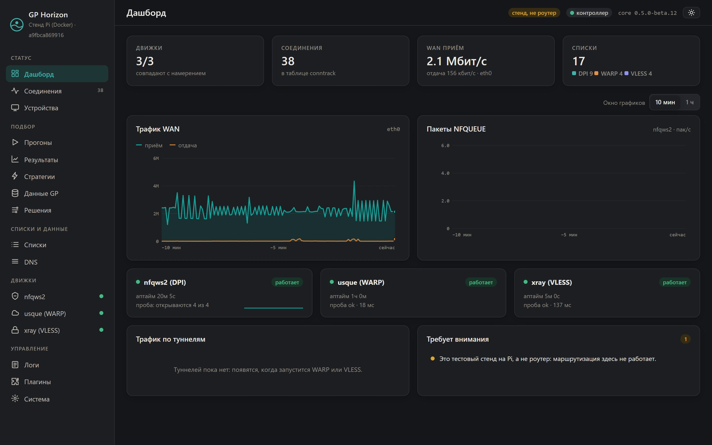
</picture>

<sub>Снимки сделаны на демо-стенде с движками-заглушками: данные учебные, интерфейс помечает стенд.</sub>

</div>

---

> Проект раньше назывался **nuxk Horizon**. Технические имена сохранены: команда `nuxk` на
> роутере, `nuxk-pi` на Pi, объекты `nuxk-*` в Keenetic, пути `/opt/etc/nuxk` и `~/nuxk`.
> Их переименование на работающих установках не даёт пользы и несёт риск сбоя.

## Содержание

- [О проекте](#о-проекте)
- [Возможности](#возможности)
- [Скриншоты](#скриншоты)
- [Архитектура](#архитектура)
- [Требования](#требования)
- [Установка](#установка)
- [Работа с панелью](#работа-с-панелью)
- [Обновление и удаление](#обновление-и-удаление)
- [Устранение неполадок](#устранение-неполадок)
- [Безопасность](#безопасность)
- [Документация](#документация)
- [Разработка](#разработка)
- [Сторонние компоненты](#сторонние-компоненты)
- [Лицензия](#лицензия)

## О проекте

Провайдеры ограничивают доступ к сайтам двумя способами: распознают имя сайта в
незашифрованной части TLS-соединения (DPI) или блокируют IP-адреса. Против первого
достаточно изменить форму пакетов на роутере, против второго нужен туннель.

GP Horizon объединяет оба подхода на роутере Keenetic. Домены раскладываются по трём
спискам — **DPI**, **WARP** и **VLESS**; агент на роутере передаёт список DPI в nfqws2, а
списки туннелей превращает во встроенную маршрутизацию KeeneticOS по доменам. Роутер
привязывает адреса сайта к маршруту в момент ответа DNS, поэтому поддомены покрываются
сами, а остальной трафик идёт как обычно.

Проект работает в двух вариантах:

| | **Лайт** | **Фул** |
|---|---|---|
| Состав | Агент на роутере | Агент на роутере и контроллер на Raspberry Pi |
| Панель | на роутере, `http://<роутер>:4141` | на Pi, `http://<pi>:4200` |
| История графиков | 10 минут, в браузере | 1 час, на контроллере |
| Подбор стратегий nfqws2 | — | плагин GP |
| Серверы VLESS | одна ссылка или подписка | любое число ссылок и подписок на Pi |

Роутер работает и без Pi: списки и желаемое состояние хранятся на нём.

## Возможности

**Маршрутизация по спискам**
- Три режима: DPI — напрямую через nfqws2; WARP и VLESS — через туннель, средствами
  маршрутизации KeeneticOS по доменам (RCI).
- Режим плана по умолчанию: панель показывает, какие объекты появятся на роутере, и ничего
  не меняет, пока применение не включено.
- Только собственные объекты `nuxk-*`; домены из ваших списков Keenetic показываются как
  конфликты и не изменяются. Импорт существующих списков Keenetic.
- Поведение при падении туннеля: «напрямую» или «блокировать».

**Движки**
- **nfqws2** — штатный пакет nfqws2-keenetic, которым nuxk управляет через адаптер, не
  изменяя пакет. Стратегии по доменам — из подбора, с копией конфигурации и откатом.
- **WARP** — клиент usque, туннель Cloudflare WARP без собственного сервера.
- **VLESS** — xray-core: ссылка `vless://` или подписка 3x-ui, Reality и TLS, переключение
  серверов подписки, автоматическое обновление подписки.

**Диагностика**
- Проба по вашим сайтам: роутер регулярно открывает их и сообщает, где обрывается
  соединение — DNS, TCP, TLS, подменённый сертификат, нет ответа HTTP. По причине видно,
  что нужно: стратегия nfqws2 (блокировка по имени) или туннель (блокировка по IP).
- Дашборд: движки, трафик WAN и туннелей, пакеты NFQUEUE, соединения (conntrack).
- Журнал роутера и Pi в одной ленте с переключателем подробной отладки, который сам
  выключается по таймеру. *(0.5)*

**Защищённый DNS** *(0.5, бета)*
- Роутер спрашивает nuxk, nuxk — серверы DoH через туннель (VLESS, затем WARP, затем
  напрямую): провайдер не подменит ответ, а маршрутизация по доменам получает настоящие
  адреса.
- Кэш с учётом TTL, заблаговременное обновление и последний известный адрес при сбое
  туннелей. Проверка, подменяет ли провайдер DNS. Вариант с SmartDNS.

**Подбор стратегий nfqws2** *(фул)*
- Плагин на ядре [GP Access Control Plane](https://github.com/balbomush/GP-access-control-plane)
  с zapret2 blockcheck2: прогоны с Pi через роутер.
- Домены из списков GP Horizon, категорий v2fly, списков GP или вручную; три режима
  прогона; живой журнал и ход; история с причиной завершения; фильтры стратегий; бэкапы
  GP. *(полный раздел — 0.5)*
- Найденная стратегия ставится на роутер кнопкой: профиль nfqws2 только для выбранных
  доменов, копия конфигурации и автоматический откат, если nfqws2 не запустился.

**Обновления и установка**
- Подписанные релизы: подпись проверяет агент, уже работающий на роутере, до замены файлов.
- Обновление роутера кнопкой, «Обновить всё» для роутера и Pi одним действием, установка
  WARP, VLESS, SmartDNS и nfqws2 кнопкой. *(0.5)*
- Автоматический откат, если новая версия не ответила.

> Пометка *(0.5)* — возможность есть в бета-версиях 0.5.0 и отсутствует в стабильном
> релизе 0.4.0.

## Скриншоты

<table>
  <tr>
    <td width="50%"><a href="docs/screenshots/lists.webp">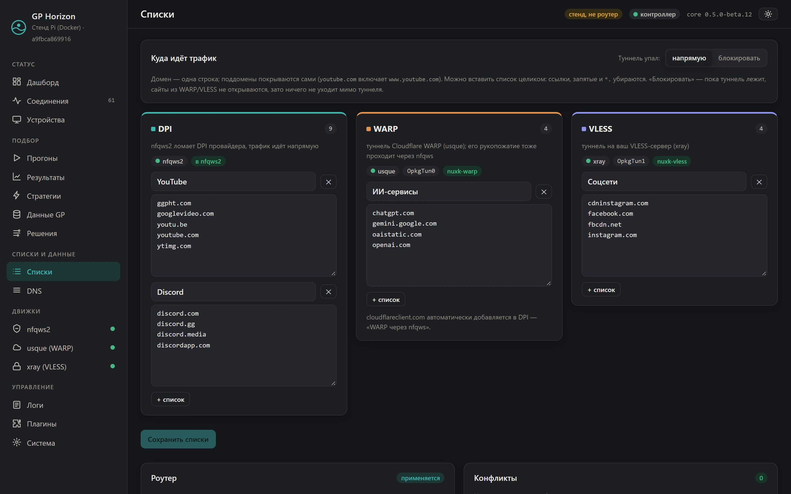</a><br><sub><b>Списки.</b> Домены по трём путям, план и применение на роутере, конфликты.</sub></td>
    <td width="50%"><a href="docs/screenshots/nfqws2.webp">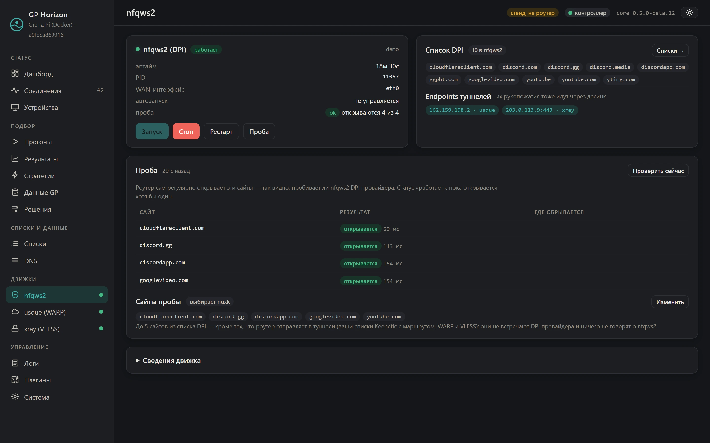</a><br><sub><b>nfqws2.</b> Проба по сайтам из списка DPI, endpoints туннелей.</sub></td>
  </tr>
  <tr>
    <td><a href="docs/screenshots/xray.webp">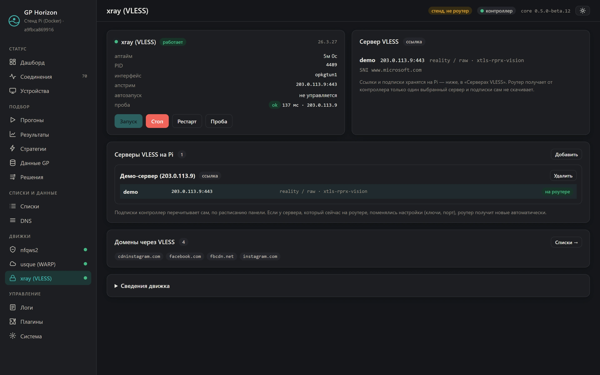</a><br><sub><b>VLESS.</b> Сервер на роутере, серверы и подписки на Pi.</sub></td>
    <td><a href="docs/screenshots/runs.webp">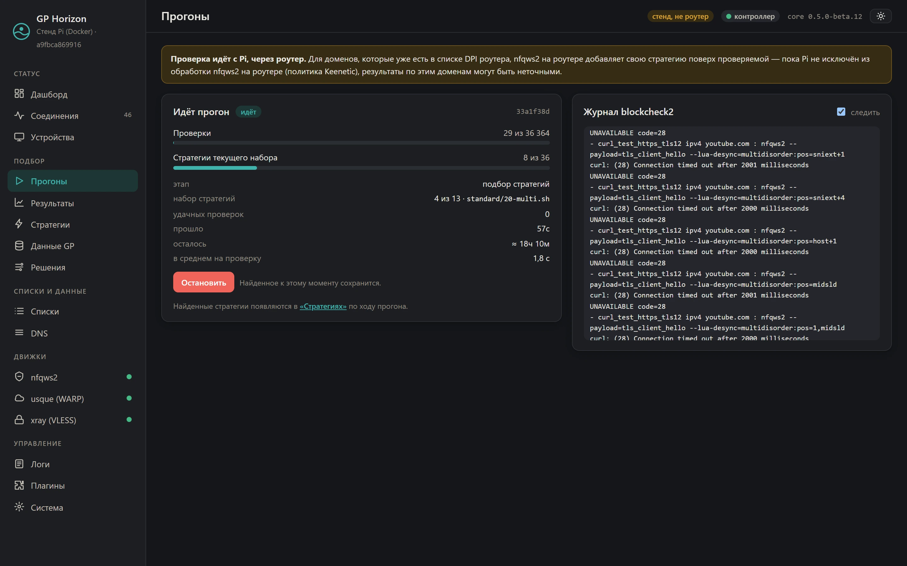</a><br><sub><b>Подбор стратегий.</b> Ход прогона GP и журнал blockcheck2.</sub></td>
  </tr>
  <tr>
    <td><a href="docs/screenshots/results.webp">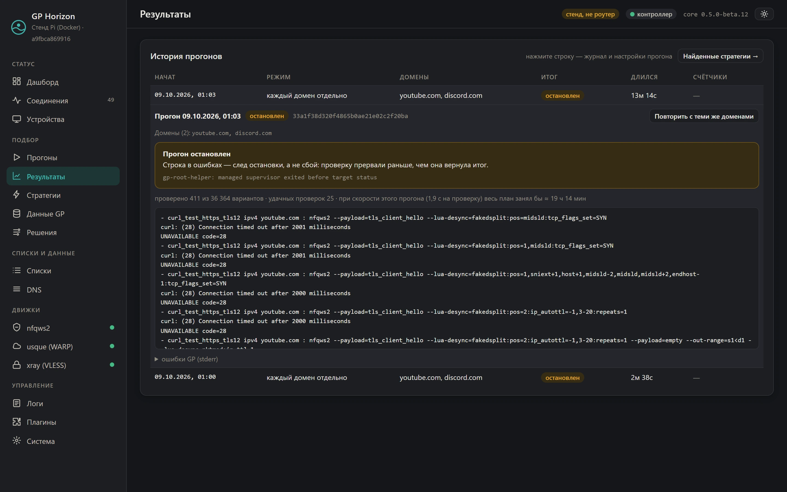</a><br><sub><b>Результаты.</b> История прогонов, причина завершения, журнал.</sub></td>
    <td><a href="docs/screenshots/strategies.webp">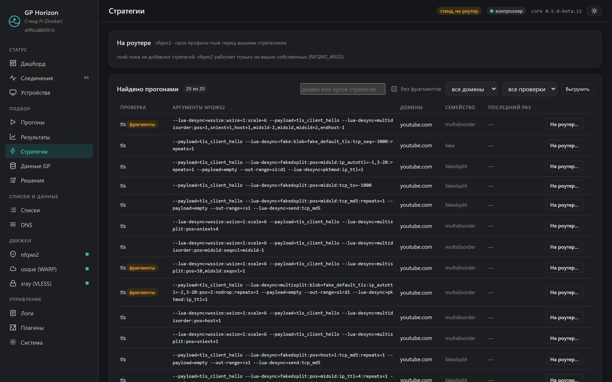</a><br><sub><b>Стратегии.</b> Найденное, поиск, выгрузка, установка на роутер.</sub></td>
  </tr>
  <tr>
    <td><a href="docs/screenshots/logs.webp">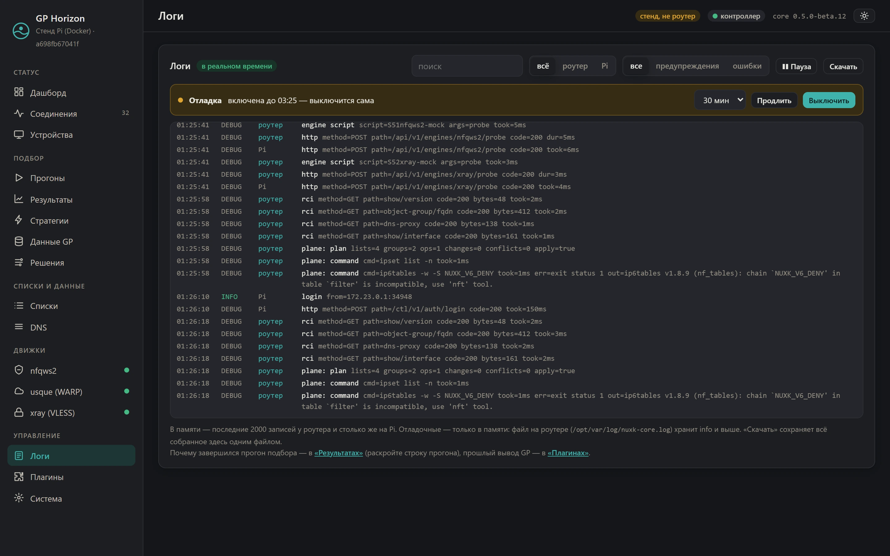</a><br><sub><b>Логи.</b> Роутер и Pi в одной ленте, отладка по таймеру.</sub></td>
    <td><a href="docs/screenshots/system.webp">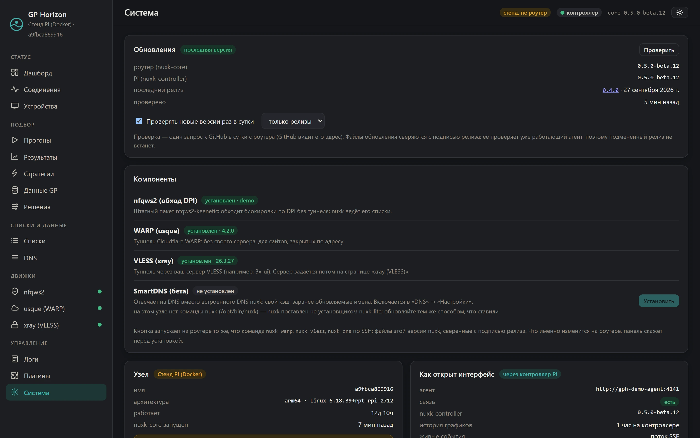</a><br><sub><b>Система.</b> Обновления, компоненты, сведения об узле.</sub></td>
  </tr>
  <tr>
    <td><a href="docs/screenshots/lite.webp">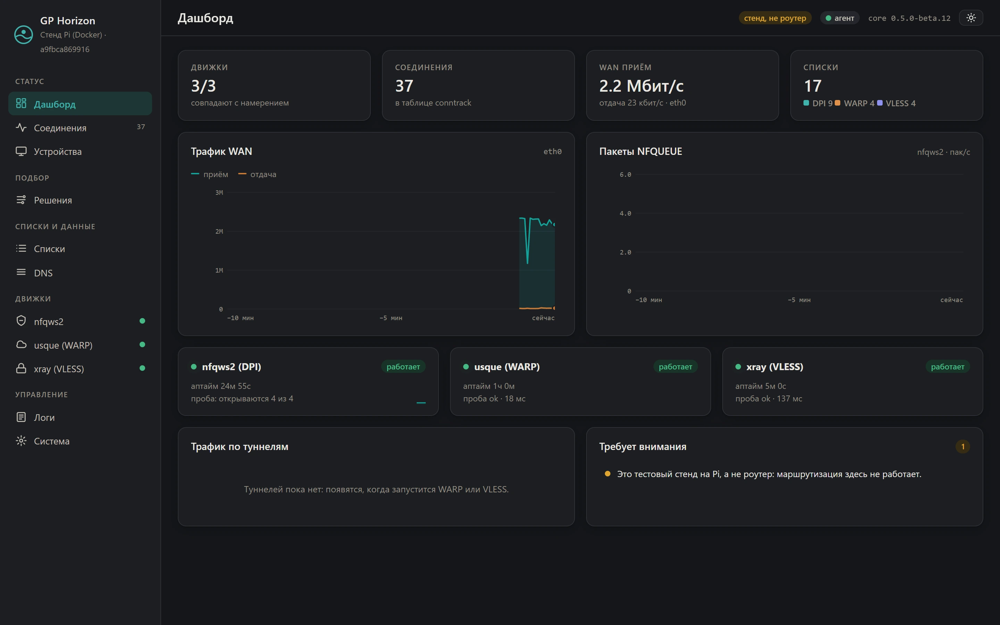</a><br><sub><b>Лайт.</b> Панель на самом роутере, без Pi.</sub></td>
    <td align="center"><a href="docs/screenshots/mobile.webp">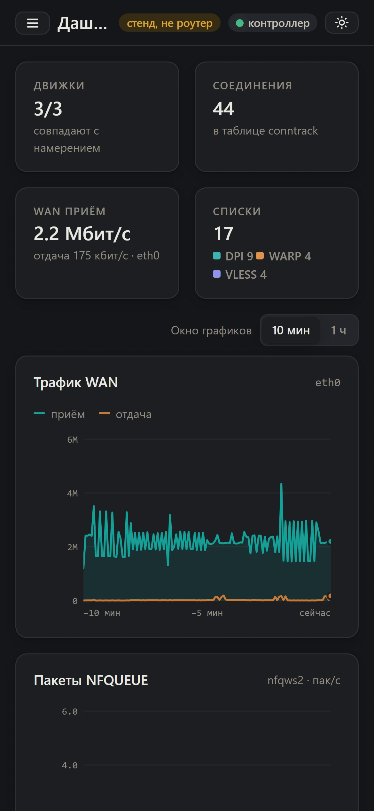</a><br><sub><b>Телефон.</b> Панель адаптирована под узкий экран.</sub></td>
  </tr>
</table>

## Архитектура

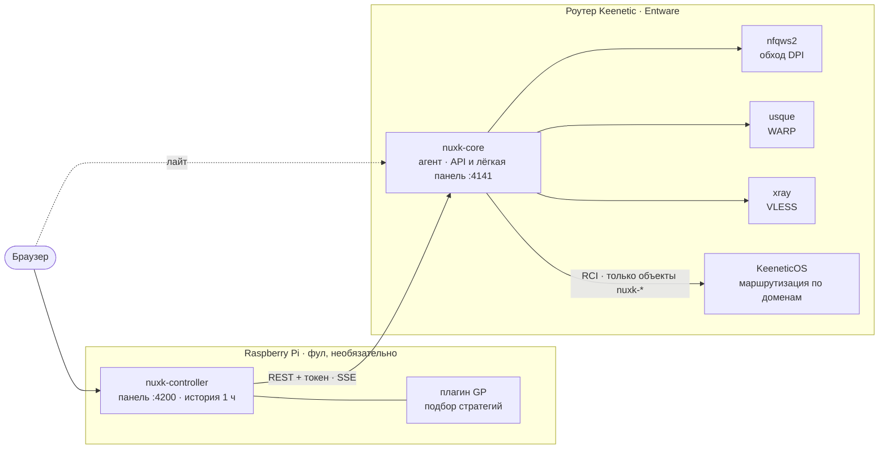

| Компонент | Где | Назначение |
|---|---|---|
| `nuxk-core` | роутер | Агент на Go (только стандартная библиотека, один исполняемый файл на архитектуру): движки, списки, маршрутизация, проба, DNS, API и лёгкий веб-интерфейс. |
| Адаптеры движков | роутер | init-скрипты, через которые агент управляет nfqws2, usque, xray и SmartDNS по единому интерфейсу. |
| `nuxk-controller` | Pi | Полный веб-интерфейс, история графиков, прокси к агенту, серверы VLESS, хост плагинов, обновление Pi. |
| `nuxk-web` | оба | Веб-интерфейс на Svelte 5: сборка `full` для Pi и `lite` для роутера. |
| Плагин GP | Pi | Ядро GP Access Control Plane и zapret2 в контейнере контроллера. |

Контракт между контроллером и агентом —
[`nuxk-core/api/openapi.yaml`](nuxk-core/api/openapi.yaml). CI проверяет, что спецификация
совпадает с маршрутами агента; типы веб-интерфейса генерируются из неё.

## Требования

**Роутер**

| | |
|---|---|
| Модель и прошивка | Keenetic с KeeneticOS 4.x или 5.x; для WARP пакет usque-keenetic рассчитан на KeeneticOS 5.0 и новее |
| Компоненты KeeneticOS | «Поддержка открытых пакетов OPKG», «Модули ядра подсистемы Netfilter» (без них nfqws2 не запустится); рекомендуется «Протокол IPv6» |
| Entware | на USB-накопителе (ext4) или во внутренней памяти, доступ по SSH |
| Архитектура | aarch64, mipsel или mips |
| Свободное место в `/opt` | около 20 МБ; для VLESS — ещё около 70 МБ на время установки xray |
| Время | синхронизация по NTP (без точного времени не работает HTTPS) |

**Raspberry Pi** — только для полной версии

| | |
|---|---|
| Система | 64-битный Linux: Raspberry Pi 4/5 с 64-bit OS или любой x86_64 |
| ПО | Docker с плагином `docker compose`, `curl` |
| Сеть | Pi в той же сети, что и роутер; доступ к роутеру по SSH на время установки на роутер |

## Установка

Установщики не собирают программы на устройствах: они скачивают готовые файлы релиза и
сверяют каждый с подписанным `SHA256SUMS`. На роутере ничего не меняется без вашего ответа
«да», а маршрутизация по спискам после установки работает в режиме плана.

> **Версии.** Ссылка `releases/latest` ставит последний **стабильный** релиз — сейчас
> 0.4.0. Возможности с пометкой *(0.5)* есть в бета-версиях 0.5.0: чтобы поставить бету,
> используйте ссылку с её номером со [страницы релизов](https://github.com/AtomAlex12/gp-horizon/releases),
> например `…/releases/download/v0.5.0-beta.11/nuxk-lite.sh`.

### 1. Подготовка роутера

1. **Компоненты.** Веб-интерфейс Keenetic → «Управление» → «Параметры системы» → «Изменить
   набор компонентов»: включите «Поддержка открытых пакетов OPKG» и «Модули ядра подсистемы
   Netfilter». Роутер перезагрузится.
2. **Entware** — по [инструкции Keenetic](https://help.keenetic.com/hc/ru/articles/360021214160).
3. **Время** — «Дата и время» → синхронизация по NTP.
4. **SSH в Entware** с компьютера в той же сети:

   ```sh
   ssh root@192.168.1.1 -p 222
   ```

   Порт Entware — `222`, если в Keenetic включён собственный SSH, иначе `22`. Пароль по
   умолчанию — `keenetic`; смените его командой `passwd` — этим паролем вы будете входить и в
   панель. Признак, что вы в Entware: `opkg --version` отвечает. Приглашение `(config)>` —
   это консоль Keenetic, а не Entware.

Резервная копия конфигурации Keenetic перед установкой: «Параметры системы» → «Файлы» →
`startup-config`.

### 2а. Лайт — на роутере

```sh
opkg update && opkg install curl ca-certificates
curl -fsSLo /opt/tmp/nuxk-lite.sh https://github.com/AtomAlex12/gp-horizon/releases/latest/download/nuxk-lite.sh
sh /opt/tmp/nuxk-lite.sh
```

Установщик проверит роутер, покажет план и спросит, что ставить:

- **nfqws2** — обход DPI, основа nuxk (по умолчанию «да»). Штатный nfqws2 начинает
  обрабатывать трафик по своей конфигурации сразу после установки.
- **WARP** и **VLESS** — по желанию. Каждый создаёт интерфейс OpkgTun в Keenetic и
  сохраняет конфигурацию роутера; для VLESS нужен собственный сервер (например, 3x-ui).

Панель: `http://<роутер>:4141`, вход — `root` и пароль Entware.

### 2б. Фул — на Raspberry Pi

```sh
curl -fsSL https://get.docker.com | sh          # если Docker ещё не установлен
sudo usermod -aG docker $USER                    # затем перелогиньтесь
curl -fsSLo nuxk-full.sh https://github.com/AtomAlex12/gp-horizon/releases/latest/download/nuxk-full.sh
sh nuxk-full.sh
```

Установщик запустит контроллер из образа `ghcr.io/atomalex12/nuxk-horizon-controller`,
установит службу обновления и команду `nuxk-pi` (один раз спросит пароль `sudo`) и
предложит поставить nuxk на роутер по SSH — с теми же вопросами, что в шаге 2а. Пароль
Entware вы вводите в `ssh`, установщику он недоступен.

Панель: `http://<pi>:4200`. Мастер настройки попросит задать пароль администратора (логин
`admin`) и подключит роутер: пароль `root` нужен один раз, чтобы получить ключ доступа, и
нигде не сохраняется.

Пошаговая установка с проверкой и откатом на каждом этапе — [`docs/BETA.md`](docs/BETA.md).

## Работа с панелью

1. **«Списки»** — добавьте домены: в «DPI» — то, что откроется обходом DPI, в «WARP» и
   «VLESS» — то, что должно идти через туннель. Существующий список nfqws2 при установке
   переносится в «DPI».
2. **Сервер VLESS** — страница «xray (VLESS)»: ссылка `vless://` или подписка 3x-ui.
3. **Проверка плана** — внизу «Списков»: что nuxk сделает на роутере и есть ли конфликты.
4. **Включение маршрутизации.** На роутере в `/opt/etc/nuxk/nuxk.conf` установите
   `PLANE_APPLY="1"` и перезапустите агент:

   ```sh
   /opt/etc/init.d/S99nuxk-core restart
   ```

   Начните с одного тестового домена: убедитесь, что он открывается через туннель
   (`https://www.cloudflare.com/cdn-cgi/trace` показывает `warp=on` для WARP), и только затем
   переносите остальные.

## Обновление и удаление

| Задача | Роутер | Pi |
|---|---|---|
| Обновить | «Система» → «Обновления» → «Обновить» или `nuxk update` | «Обновить всё» (роутер, затем Pi) или `nuxk-pi update` |
| Конкретная версия | `NUXK_VERSION=X nuxk update` | `NUXK_VERSION=X nuxk-pi update` |
| Вернуть прежнюю | `nuxk rollback` | автоматически, если новый контроллер не ответил за 60 с |
| Добавить компонент | «Система» → «Компоненты» или `nuxk warp` · `vless` · `dns` · `nfqws2` | — |
| Удалить | `nuxk uninstall` | `nuxk-pi uninstall` (с данными — `--purge`) |

Обновление роутера проверяет подпись релиза, перезапускает агент на несколько секунд (обход
и туннели продолжают работать) и, если новая версия не ответила за 15 с, возвращает прежнюю.
Кнопка «Обновить всё» появляется после первой установки службы обновления на Pi
(`sh ~/nuxk/nuxk-full.sh update`).

Полный перечень команд и параметров — [`docs/commands.md`](docs/commands.md).

## Устранение неполадок

| Симптом | Действие |
|---|---|
| `opkg: not found` или приглашение `(config)>` | Вы не в Entware: подключитесь по SSH к порту Entware. |
| `curl: (60) SSL certificate problem` | Включите синхронизацию времени и выполните `opkg install ca-certificates`. |
| `curl: (22) … 404` | Команда оборвалась при копировании — вставьте её одной строкой. |
| «Модули Netfilter» в плане установщика | Включите компонент «Модули ядра подсистемы Netfilter». |
| Панель не открывается | `nuxk` покажет, что не работает; журнал — `tail -50 /opt/var/log/nuxk-core.log`. |
| После обновления что-то работает не так | `nuxk rollback` вернёт прежнюю версию. |
| Перестал открываться какой-то сайт | Остановите nfqws2 в панели или `/opt/etc/init.d/S51nfqws2 stop`; сообщите в issues. |
| Нужно понять, что происходит | «Логи» → «Отладка»: каждый шаг агента и контроллера; «Скачать» сохраняет журнал файлом. |

При обращении в issues приложите вывод установщика, `tail -50 /opt/var/log/nuxk-core.log` и
`cat /opt/var/log/nuxk-core.crash` (если файл есть). Не прикладывайте `nuxk.conf` целиком и
вывод `show running-config`.

## Безопасность

- Маршрутизация изменяет только объекты `nuxk-*`, по умолчанию работает в режиме плана и не
  сохраняет свои объекты в конфигурацию роутера.
- `SHA256SUMS` каждого релиза подписан ключом Ed25519; подпись проверяет агент на роутере
  до установки. Отпечаток ключа: `SHA256:T2omf5hHIbtKjT4l5WOoKb4dj2syNWjHDDy+5j1xSr4`.
- Агент доступен только в локальной сети; вход — учётной записью роутера с защитой от
  подбора. Пароль администратора контроллера хранится как PBKDF2-SHA256.
- Контроллер работает в контейнере с файловой системой только для чтения и минимальными
  правами; плагины получают только права из своего описания.

Подробно — [`docs/security.md`](docs/security.md).

## Документация

| Документ | Содержание |
|---|---|
| [Установка по этапам](docs/BETA.md) | Подготовка роутера, лайт, фул, плагин GP, списки, применение, VLESS, защищённый DNS — с проверкой и откатом на каждом этапе. |
| [Справочник команд](docs/commands.md) | `nuxk`, `nuxk-pi`, init-скрипты, флаги агента, режимы контроллера, команды разработки. |
| [Конфигурация](docs/configuration.md) | Все ключи `nuxk.conf`, переменные контроллера, файлы, каталоги и порты. |
| [API](docs/api.md) | Авторизация, маршруты агента и контроллера, события SSE. |
| [Безопасность](docs/security.md) | Изменения на роутере, цепочка поставки, доступ, плагины, журналы. |
| [История изменений](CHANGELOG.md) | Изменения по версиям. |

## Разработка

```sh
cd nuxk-core && go run . -config testdata/nuxk.conf -debug   # агент с движками-заглушками, :4141
cd nuxk-web  && npm install && npm run dev                   # веб-интерфейс :5173, /api → :4141
make check                                                   # всё, что выполняет CI
```

| Каталог | Содержимое |
|---|---|
| [`nuxk-core/`](nuxk-core) | Агент (Go, только стандартная библиотека). `internal/api` — маршруты, `core` — контроллер движков, `plane` — списки и Keenetic, `engine` — адаптеры, `dns` — защищённый DNS, `node` — метрики, `logbuf` — журнал. |
| [`nuxk-controller/`](nuxk-controller) | Контроллер для Pi: прокси, история, серверы VLESS, хост плагинов, рецепты плагинов. |
| [`nuxk-web/`](nuxk-web) | Веб-интерфейс (Svelte 5, Vite, TypeScript). |
| [`engines/`](engines) | Адаптеры nfqws2, xray и SmartDNS; форк usque-keenetic. |
| [`install/`](install) | Установщики `nuxk-lite.sh` и `nuxk-full.sh` и их тесты. |
| [`deploy/`](deploy) | Образ контроллера для релиза, стенды разработки на Pi, мок-стек. |

Правила, которых придерживается проект: API агента меняется только вместе с контрактом
`openapi.yaml`; агент не использует сторонних зависимостей; интерфейс не показывает
выдуманных данных — стенд всегда помечен как стенд.

### Версии и релизы

- Версия задаётся только в [`VERSION`](VERSION) (SemVer); `scripts/version.sh set X.Y.Z`
  обновляет её и в `nuxk-web/package.json`. Изменения описываются в
  [`CHANGELOG.md`](CHANGELOG.md).
- Тег `vX.Y.Z` на `main` запускает GitHub Actions: `make check`, `make release`, образ
  контроллера на `ghcr.io` для arm64 и amd64, его отпечаток в релизе и подпись
  `SHA256SUMS` ключом из секрета `NUXK_SIGNING_KEY`. Тег с дефисом (`-beta.N`) публикуется
  как pre-release.
- Форк со своими релизами: создайте ключ (`ssh-keygen -t ed25519`), открытую часть
  поместите в `nuxk-core/internal/release/allowed_signers` и `install/nuxk-full.sh`, закрытую
  — в секрет `NUXK_SIGNING_KEY`.

## Сторонние компоненты

GP Horizon управляет программами других авторов и не форкает их ядра: версии закреплены и
проверяются по хешам.

| Компонент | Источник | Назначение |
|---|---|---|
| nfqws2-keenetic | [nfqws/nfqws2-keenetic](https://github.com/nfqws/nfqws2-keenetic) | Обход DPI |
| usque | [Diniboy1123/usque](https://github.com/Diniboy1123/usque); пакет — форк [side-effect-tm/usque-keenetic](https://github.com/side-effect-tm/usque-keenetic) в [`engines/nuxk-usque`](engines/nuxk-usque) | Клиент Cloudflare WARP |
| xray-core | [XTLS/Xray-core](https://github.com/XTLS/Xray-core) | Клиент VLESS |
| SmartDNS | [pymumu/smartdns](https://github.com/pymumu/smartdns) | DNS-сервер (бета) |
| GP Access Control Plane | [balbomush/GP-access-control-plane](https://github.com/balbomush/GP-access-control-plane) (MIT) | Ядро подбора стратегий |
| zapret2 | [bol-van/zapret2](https://github.com/bol-van/zapret2) | blockcheck2 и nfqws2 в подборе стратегий |

## Лицензия

[MIT](LICENSE).
